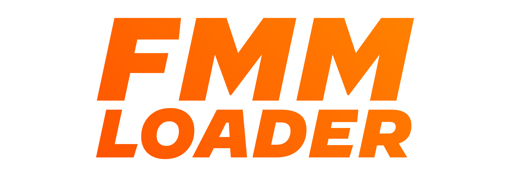

<p align="center">
  
</p>

<div align="center">

# FMMLoader26

### 🎮 Cross-Platform Mod Manager for Football Manager 2026

[](https://creativecommons.org/licenses/by-nc-sa/4.0/)
[](https://discord.gg/AspRvTTAch)
[](https://ko-fi.com/jalco)

[](https://github.com/justinlevinedotme/FMMLoader-26/releases/latest)
[](https://github.com/justinlevinedotme/FMMLoader-26/releases/latest)
[](https://github.com/justinlevinedotme/FMMLoader-26/graphs/contributors)
[](https://github.com/justinlevinedotme/FMMLoader-26/stargazers)
[](https://github.com/justinlevinedotme/FMMLoader-26/issues)
[](https://github.com/justinlevinedotme/FMMLoader-26/pulls)

[](https://github.com/justinlevinedotme/FMMLoader-26/releases/latest)
[](https://github.com/justinlevinedotme/FMMLoader-26/releases/latest)
[](https://github.com/justinlevinedotme/FMMLoader-26/releases/latest)
[](https://www.python.org/)
[](https://github.com/psf/black)

<p align="center">
  <a href="https://github.com/justinlevinedotme/FMMLoader-26/wiki">📖 Wiki</a> •
  <a href="https://github.com/justinlevinedotme/FMMLoader-26/releases/latest">⬇️ Download</a> •
  <a href="#-installation">🚀 Installation</a> •
  <a href="#-features">✨ Features</a> •
  <a href="#-usage-guide">📚 Usage</a> •
  <a href=".github/modders.md">🔧 For Modders</a> •
  <a href="https://discord.gg/AspRvTTAch">💬 Discord</a>
</p>

</div>

---

## 📝 About

**FMMLoader26** is a powerful, user-friendly **cross-platform mod manager** for *Football Manager 2026*. It simplifies the entire modding experience—from installation to conflict resolution—making it easy to customize your game with UI enhancements, tactics, graphics packs, skins, and more.

**Developed with ❤️ by [Justin Levine](https://justinlevine.me) (JALCO / notJalco)**

### 🎯 Why FMMLoader26?

- **⚡ Zero Installation** - Standalone executables for Windows and macOS
- **🎨 Beautiful GUI** - Clean, intuitive interface built with Tkinter
- **🔄 Drag & Drop** - Import mods effortlessly with drag-and-drop support
- **🛡️ Safe & Reversible** - Automatic backups and restore points before every change
- **🔍 Smart Detection** - Automatically finds your FM26 installation (Steam & Epic)
- **⚙️ Type-Aware** - Intelligently installs different mod types to the correct locations
- **🚨 Conflict Resolution** - Detects and helps resolve file conflicts between mods
- **📊 Detailed Logging** - Comprehensive logs for troubleshooting

---

## 📋 Table of Contents

- [System Requirements](#-system-requirements)
- [Installation](#-installation)
  - [Windows](#-windows-installation)
  - [macOS](#-macos-installation)
  - [Linux](#-linux-installation-from-source)
- [Features](#-features)
- [Usage Guide](#-usage-guide)
- [Supported Mod Types](#-supported-mod-types)
- [Troubleshooting](#-troubleshooting)
- [For Modders](#-for-modders)
- [Contributing](#-contributing)
- [Support & Community](#-support--community)
- [License](#-license)
- [Acknowledgments](#-acknowledgments)

---

## 💻 System Requirements

### Minimum Requirements

| Component | Requirement |
|-----------|-------------|
| **OS** | Windows 10/11, macOS 10.14+, Linux (Ubuntu 20.04+) |
| **RAM** | 512 MB |
| **Disk Space** | 100 MB (plus space for mods) |
| **FM26** | Football Manager 2026 installed (Steam or Epic) |

### Optional Dependencies

- **Python 3.8+** (only for running from source)
- **psutil** (for FM process detection)
- **tkinterdnd2** (for drag-and-drop support)

---

## 🚀 Installation

### 🖥️ Windows Installation

<details>
<summary>Click to expand Windows installation steps</summary>

#### Step 1: Download
1. Go to [Releases](https://github.com/justinlevinedotme/FMMLoader-26/releases/latest)
2. Download **`FMMLoader26.exe`**

#### Step 2: Run
1. Double-click `FMMLoader26.exe` to launch
2. **Windows Defender SmartScreen may warn you:**
   - Click **"More info"**
   - Click **"Run anyway"**
3. No installation required—the app runs directly!

#### Optional: Pin to Taskbar
Right-click the running app and select **"Pin to taskbar"** for quick access.

</details>

### 🍎 macOS Installation

<details>
<summary>Click to expand macOS installation steps</summary>

#### Step 1: Download & Extract
1. Go to [Releases](https://github.com/justinlevinedotme/FMMLoader-26/releases/latest)
2. Download **`FMMLoader26.zip`**
3. Unzip the file (double-click the .zip)

#### Step 2: Move to Applications
Drag **FMMLoader26.app** to your `/Applications` folder (or anywhere you prefer)

<p align="center">
  
</p>

#### Step 3: Bypass Gatekeeper
Since the app isn't signed with an Apple Developer certificate, you'll need to bypass Gatekeeper:

**Method 1: Control-Click**
1. **Control-Click** (or right-click) the app
2. Select **"Open"**
3. Click **"Open"** in the dialog

<p align="center">
  
</p>

**Method 2: System Settings** (if Method 1 doesn't work)
1. Try to open the app normally (you'll get a security warning)
2. Go to **System Settings → Privacy & Security**
3. Scroll down to the **Security** section
4. Click **"Open Anyway"** next to the FMMLoader26 message
5. Confirm by clicking **"Open"** in the popup

<p align="center">
  
</p>

> **Note:** You only need to do this once. After the first launch, macOS will remember your choice.

#### Optional: Add to Dock
Drag the app from Applications to your Dock for easy access.

</details>

### 🐧 Linux Installation (from source)

<details>
<summary>Click to expand Linux installation steps</summary>

#### Prerequisites
```bash
sudo apt update
sudo apt install python3 python3-pip python3-tk
```

#### Install from source
```bash
# Clone the repository
git clone https://github.com/justinlevinedotme/FMMLoader-26.git
cd FMMLoader-26

# Install dependencies
pip3 install -r src/requirements.txt

# Optional: Install tkinterdnd2 for drag-and-drop
pip3 install tkinterdnd2

# Run the application
python3 src/fmmloader26.py
```

#### Optional: Create a desktop launcher
Create a file `~/.local/share/applications/fmmloader26.desktop`:
```ini
[Desktop Entry]
Name=FMMLoader26
Comment=Football Manager 2026 Mod Manager
Exec=/usr/bin/python3 /path/to/FMMLoader-26/src/fmmloader26.py
Icon=/path/to/FMMLoader-26/src/assets/icon.ico
Terminal=false
Type=Application
Categories=Game;Utility;
```

</details>

---

## ✨ Features

### 🎮 Core Features

<table>
  <tr>
    <td width="50%">
      <h4>🚀 One-Click Mod Management</h4>
      Enable, disable, and reorder mods with simple clicks. No manual file copying required.
    </td>
    <td width="50%">
      <h4>📦 Multi-Format Import</h4>
      Import mods from .zip archives, folders, or individual .bundle/.fmf files—all with drag-and-drop support.
    </td>
  </tr>
  <tr>
    <td>
      <h4>🔍 Automatic Detection</h4>
      Automatically detects your FM26 installation from Steam or Epic Games on Windows and macOS.
    </td>
    <td>
      <h4>⚙️ Type-Aware Installation</h4>
      Intelligently routes different mod types to their correct locations:
      <ul>
        <li><b>UI/Bundle mods</b> → Game data folder</li>
        <li><b>Tactics</b> → User tactics folder</li>
        <li><b>Graphics</b> → User graphics folder (kits/faces/logos)</li>
        <li><b>Skins</b> → User skins folder</li>
      </ul>
    </td>
  </tr>
  <tr>
    <td>
      <h4>🛡️ Safety First</h4>
      <ul>
        <li>Automatic backups before every change</li>
        <li>Restore points with one-click rollback</li>
        <li>Detects if FM is running and prevents changes</li>
        <li>Non-destructive operations</li>
      </ul>
    </td>
    <td>
      <h4>⚔️ Conflict Manager</h4>
      Detects when multiple mods modify the same files and helps you resolve conflicts before applying changes.
    </td>
  </tr>
  <tr>
    <td>
      <h4>📊 Load Order Control</h4>
      Precisely control which mods override others using a last-write-wins system. Move mods up or down in priority.
    </td>
    <td>
      <h4>🔎 Mod Filtering</h4>
      Filter your mod list by type (UI, graphics, tactics, database, etc.) to quickly find what you need.
    </td>
  </tr>
  <tr>
    <td>
      <h4>📝 Detailed Logging</h4>
      Every operation is logged with timestamps. View logs directly in the app or open the logs folder.
    </td>
    <td>
      <h4>🔄 Automatic Updates</h4>
      Built-in update checker notifies you when new versions are available.
    </td>
  </tr>
  <tr>
    <td>
      <h4>🌐 Cross-Platform</h4>
      Works seamlessly on Windows, macOS, and Linux with platform-specific optimizations.
    </td>
    <td>
      <h4>📱 Manifest Support</h4>
      Reads mod metadata from manifest.json files for detailed mod information and dependencies.
    </td>
  </tr>
</table>

### 🛠️ Advanced Features

- **Custom Install Paths**: Override default installation locations per mod
- **Platform-Specific Mods**: Support for mods that work on specific platforms only
- **Dependency Management**: Manifest support for mod dependencies and conflicts
- **Graphics Pack Support**: Smart handling of kits, faces, and logo packs with subfolder detection
- **Restore Point Management**: Automatic cleanup of old backups (keeps last 10)
- **Manifest Generator**: Automatically creates manifests for mods that don't have one
- **Multi-Format Archives**: Support for nested .zip structures and various mod packaging formats

---

## 📚 Usage Guide

### 1️⃣ First Launch: Set Your Target Folder

When you first launch FMMLoader26, you need to tell it where your Football Manager 2026 is installed.

#### Option A: Automatic Detection (Recommended)
1. Click **"Detect Target"** button
2. The app will automatically find your FM26 installation
3. ✅ You're done!

#### Option B: Manual Selection
If auto-detection fails (or you have a custom installation):
1. Click **"Set Target…"** button
2. Navigate to your FM26 Standalone folder:

**Common Paths:**

| Platform | Location |
|----------|----------|
| **Windows (Steam)** | `C:\Program Files (x86)\Steam\steamapps\common\Football Manager 26\fm_Data\StreamingAssets\aa\StandaloneWindows64` |
| **Windows (Epic)** | `C:\Program Files\Epic Games\Football Manager 26\data\StreamingAssets\aa\StandaloneWindows64` |
| **macOS (Steam)** | `~/Library/Application Support/Steam/steamapps/common/Football Manager 26/fm.app/Contents/Resources/Data/StreamingAssets/aa/StandaloneOSX` |
| **macOS (Epic)** | `~/Library/Application Support/Epic/Football Manager 26/fm_Data/StreamingAssets/aa/StandaloneOSXUniversal` |

3. Click **"Select Folder"**

---

### 2️⃣ Import Mods

FMMLoader26 supports multiple import methods:

#### Method 1: Drag & Drop (Easiest)
1. Download your mod (usually a .zip file)
2. **Drag the .zip file** directly onto the FMMLoader26 window
3. If the mod doesn't have a manifest, you'll be prompted to provide metadata
4. ✅ Mod imported!

#### Method 2: Import Button
1. Click **"Import Mod…"** button
2. Choose your import type:
   - **ZIP File**: Select a .zip archive
   - **Folder**: Select a folder containing a mod
   - **Single File**: Select a .bundle or .fmf file
3. If the mod doesn't have a manifest, provide the requested information
4. ✅ Mod imported!

#### What Happens During Import?
- The mod is extracted (if it's a .zip)
- A manifest.json is created (if one doesn't exist)
- The mod is copied to your mods folder
- The mod appears in your mod list

---

### 3️⃣ Enable & Disable Mods

#### Enable a Mod
1. Select the mod in the list (click on it)
2. Click **"Enable (mark)"** button
3. The mod will show **"yes"** in the "Enabled" column
4. ⚠️ **Important**: Enabling only *marks* the mod—you must click **"Apply"** to actually install it

#### Disable a Mod
1. Select the mod in the list
2. Click **"Disable (unmark)"** button
3. The "Enabled" column will become empty
4. ⚠️ Click **"Apply"** to remove the mod from your game

---

### 4️⃣ Manage Load Order

When multiple mods modify the same file, **the last mod in the load order wins**.

#### Change Load Order
1. Select a mod
2. Click **"Up (Order)"** to increase priority (load later)
3. Click **"Down (Order)"** to decrease priority (load earlier)
4. The **"Order"** column shows the load position

**Example:**
```
Order  Mod Name           Modifies File
  1    UI Mod A           ui-stadium.bundle
  2    UI Mod B           ui-stadium.bundle  ← This one wins!
```

---

### 5️⃣ Apply Your Mods

Once you've enabled mods and set their load order:

1. Click **"Apply"** button (or press **F5**)
2. FMMLoader26 will:
   - ✅ Create a restore point (automatic backup)
   - ✅ Check for file conflicts
   - ✅ Copy mod files to your FM26 folders
   - ✅ Show you a summary of changes
3. ✅ Your mods are now active!

#### Important Notes
- **Close FM26 first**: You must close Football Manager before applying mods
- **Conflict Warning**: If conflicts are detected, you'll be taken to the Conflict Manager
- **Restore Points**: A restore point is created automatically—you can rollback anytime

---

### 6️⃣ Handle Conflicts

If multiple enabled mods modify the same file, the **Conflict Manager** opens automatically.

#### Understanding Conflicts
```
File: ui-stadium.bundle
  Mods:
    - Better UI (ui) by ModderA
    - Stadium Pack (graphics) by ModderB
  Winner by load order: Stadium Pack
```

#### Resolving Conflicts

**Option 1: Adjust Load Order**
1. Close the Conflict Manager
2. Reorder your mods so the one you want wins
3. Click **"Apply"** again

**Option 2: Disable a Mod**
1. In the Conflict Manager, check the mod(s) you want to disable
2. Click **"Disable Selected Mods"**
3. Click **"Apply"** again

---

### 7️⃣ Rollback Changes

Made a mistake? Want to undo your mods? Use the rollback feature:

1. Click **"Rollback…"** button
2. Select a restore point from the list (sorted by date, newest first)
3. Click **"Rollback to selected"**
4. ✅ Your game files are restored!

**Notes:**
- Restore points are created automatically before every **"Apply"**
- FMMLoader26 keeps your 10 most recent restore points
- Rollback is **safe and reversible**

---

### 8️⃣ View Logs & Mod Details

#### View Mod Details
1. Click on any mod in the list
2. The **Details** pane shows:
   - Description
   - Author
   - Version
   - Type
   - Dependencies
   - Conflicts
   - Files being modified

#### View Logs
1. Click the **"Logs"** tab at the top
2. See real-time operation logs
3. Click **"Open Logs Folder"** to view all historical logs

---

### 9️⃣ Manage Folders

#### Quick Access Buttons
- **"Open Target"**: Opens your FM26 game folder
- **"Open User Directory"**: Opens your FM26 user data folder
- **"Open Mods Folder"**: Opens your FMMLoader26 mods folder
- **"Open Logs Folder"**: Opens your FMMLoader26 logs folder

#### Set Custom User Directory
If your Documents folder is not in the default location:
1. Go to **File → Set User Directory…**
2. Select your FM26 user folder (contains tactics/graphics/skins)
3. Click **"Select Folder"**

To reset to default: **File → Reset User Directory to Default**

---

### 🎯 Pro Tips

1. **Test One Mod at a Time**: Enable one mod, apply, test in FM26, then add more
2. **Read Mod Descriptions**: Check the details pane for compatibility info
3. **Keep Backups**: FMMLoader26 creates restore points, but you can also manually backup your FM26 folders
4. **Join Discord**: Get help, share mods, and connect with the community
5. **Update Regularly**: Check for FMMLoader26 updates for new features and bug fixes
6. **Check Mod Compatibility**: Some mods may not work together—check the conflicts list

---

## 🎨 Supported Mod Types

FMMLoader26 supports all major Football Manager mod types:

| Type | Description | Install Location | Examples |
|------|-------------|------------------|----------|
| **UI** | User interface modifications | Game data folder | UI enhancements, stadium graphics, match engine tweaks |
| **Bundle** | Game data bundles | Game data folder | Core game file modifications |
| **Tactics** | Pre-made tactical setups | User tactics folder | 4-4-2 formations, gegenpressing tactics |
| **Graphics** | Visual enhancements | User graphics folder | Logo packs, kits, player faces |
| **Misc** | Other modifications | User folder | Various other mods |

### 📦 Supported File Formats

- **.zip** archives (automatically extracted)
- **.bundle** files (Unity asset bundles)
- **.fmf** files (Football Manager tactics)
- **Folders** with manifest.json
- **Folders** without manifest (auto-generated)

---

## 🔧 Troubleshooting

### Common Issues

<details>
<summary><b>FMMLoader won't open on macOS</b></summary>

**Solution:**
1. Make sure you've bypassed Gatekeeper (see [macOS Installation](#-macos-installation))
2. Check **System Settings → Privacy & Security → App Management**
3. Give FMMLoader26 permission if requested
4. Try running from Terminal: `open /Applications/FMMLoader26.app`

</details>

<details>
<summary><b>"No valid FM26 target set" error</b></summary>

**Solution:**
1. Click **"Detect Target"** first
2. If that fails, manually set your target using **"Set Target…"**
3. Make sure you're selecting the correct Standalone folder (see [paths above](#1️⃣-first-launch-set-your-target-folder))
4. Verify FM26 is actually installed

</details>

<details>
<summary><b>Mods not appearing in FM26</b></summary>

**Checklist:**
1. ✅ Did you click **"Apply"**? (Enabling isn't enough)
2. ✅ Did you restart FM26 after applying mods?
3. ✅ Did you enable the mod? (Check "Enabled" column shows "yes")
4. ✅ Is the mod compatible with FM26? (Some FM25 mods won't work)
5. ✅ Check the logs for errors (click "Logs" tab)

</details>

<details>
<summary><b>"FM is Running" warning</b></summary>

**Solution:**
1. Completely close Football Manager 2026
2. Make sure it's not running in the background (check Task Manager on Windows, Activity Monitor on macOS)
3. Wait a few seconds and try again

**Note:** If you have **psutil** installed, FMMLoader can detect FM automatically. Otherwise, make sure FM is closed manually.

</details>

<details>
<summary><b>Drag & drop doesn't work</b></summary>

**Solution:**
1. Make sure you have **tkinterdnd2** installed (pre-installed in standalone builds)
2. On Linux, install manually: `pip3 install tkinterdnd2`
3. Use the **"Import Mod…"** button instead

</details>

<details>
<summary><b>Mod conflicts—which mod wins?</b></summary>

**Answer:**
The **last mod in load order** wins (highest number in "Order" column).

**Solution:**
1. Open **"Conflicts…"** to see which files conflict
2. Reorder mods using **"Up (Order)"** and **"Down (Order)"**
3. The mod you want to win should be **lower** in the list (higher order number)

</details>

<details>
<summary><b>Custom user directory not working</b></summary>

**Solution:**
1. Go to **File → Set User Directory…**
2. Select your custom FM26 user folder
3. Make sure the folder contains subfolders like `tactics`, `graphics`, `skins`
4. If you moved your Documents folder, you may need to use this feature

</details>

<details>
<summary><b>How do I uninstall a mod?</b></summary>

**Option 1: Disable (keeps the mod)**
1. Select the mod
2. Click **"Disable (unmark)"**
3. Click **"Apply"**

**Option 2: Remove (deletes the mod)**
1. Select the mod
2. Click **"Remove Mod"**
3. Confirm deletion
4. Click **"Apply"** to clean up files

</details>

<details>
<summary><b>Restore points taking up too much space?</b></summary>

**Answer:**
FMMLoader26 automatically keeps only the **10 most recent restore points** and deletes older ones.

**Manual cleanup:**
1. Click **"Open Mods Folder"**
2. Navigate to the parent folder
3. Open the `restore_points` folder
4. Delete old restore point folders manually

</details>

### Still Having Issues?

1. **Check the Logs**: Click the "Logs" tab to see detailed error messages
2. **Join Discord**: Get help from the community → [discord.gg/AspRvTTAch](https://discord.gg/AspRvTTAch)
3. **Open an Issue**: Report bugs on GitHub → [github.com/justinlevinedotme/FMMLoader-26/issues](https://github.com/justinlevinedotme/FMMLoader-26/issues)
4. **Read the Wiki**: Visit the [GitHub Wiki](https://github.com/justinlevinedotme/FMMLoader-26/wiki) for more help

---

## 🔧 For Modders

Are you a mod creator? FMMLoader26 supports **manifest.json** for detailed mod metadata and installation control.

📖 **[Read the Full Modders Guide](.github/modders.md)**

### Quick Start: Create a Manifest

Create a `manifest.json` file in your mod folder:

```json
{
  "name": "My Awesome Mod",
  "version": "1.0.0",
  "type": "ui",
  "author": "YourName",
  "homepage": "https://yoursite.com",
  "description": "A brief description of what your mod does",
  "files": [
    {
      "source": "ui-stadium.bundle",
      "target_subpath": "ui-stadium.bundle"
    }
  ],
  "compatibility": {
    "fm_version": "26.0.0"
  },
  "dependencies": [],
  "conflicts": [],
  "license": "CC BY-NC-SA 4.0"
}
```

### Example Mods

Check the **`example mods`** folder in this repository for reference:
- **UI Speedster** - UI enhancement mod
- **KNAP's Beta Tactics** - Tactical preset
- **Logopack** - Graphics pack example

Special thanks to **KNAP** and **bassyboy** for allowing their mods to be included!

---

## 🤝 Contributing

We welcome contributions from the community! Whether it's bug fixes, new features, documentation, or mod submissions—your help is appreciated.

### How to Contribute

1. **Fork the Repository**
   ```bash
   git clone https://github.com/YOUR-USERNAME/FMMLoader-26.git
   ```

2. **Create a Feature Branch**
   ```bash
   git checkout -b feature/amazing-feature
   ```

3. **Make Your Changes**
   - Follow the existing code style
   - Add comments where necessary
   - Test your changes thoroughly

4. **Commit Your Changes**
   ```bash
   git commit -m "Add some amazing feature"
   ```

5. **Push to Your Fork**
   ```bash
   git push origin feature/amazing-feature
   ```

6. **Open a Pull Request**
   - Go to the [Pull Requests page](https://github.com/justinlevinedotme/FMMLoader-26/pulls)
   - Click "New Pull Request"
   - Describe your changes in detail

### Contribution Guidelines

- Read the [Contributing Guide](.github/CONTRIBUTING.md)
- Follow the [Code of Conduct](.github/CODE_OF_CONDUCT.md)
- Use descriptive commit messages
- Update documentation when adding features
- Add tests for new functionality (if applicable)

### Development Setup

```bash
# Clone the repository
git clone https://github.com/justinlevinedotme/FMMLoader-26.git
cd FMMLoader-26

# Install dependencies
pip install -r src/requirements.txt

# Optional: Install development dependencies
pip install pyinstaller tkinterdnd2 psutil

# Run from source
python src/fmmloader26.py
```

### Build from Source

```bash
# Windows
pyinstaller src/fm26_mod_manager.spec

# macOS
pyinstaller src/fm26_mod_manager.spec
```

---

## 💬 Support & Community

### Get Help & Connect

- **💬 Discord Server**: Join our community for support, mod sharing, and discussions
  [](https://discord.gg/AspRvTTAch)

- **📖 GitHub Wiki**: Comprehensive guides and documentation
  [Visit the Wiki →](https://github.com/justinlevinedotme/FMMLoader-26/wiki)

- **🐛 Bug Reports**: Found a bug? Let us know!
  [Open an Issue →](https://github.com/justinlevinedotme/FMMLoader-26/issues)

- **💡 Feature Requests**: Have an idea? We'd love to hear it!
  [Request a Feature →](https://github.com/justinlevinedotme/FMMLoader-26/issues/new)

### Support the Project

FMMLoader26 is **free and open-source**, developed as a passion project. If you find it useful, consider supporting:

- **⭐ Star this repository** - Helps others discover the project
- **💰 Support on Ko-fi** - Help fund development
  [](https://ko-fi.com/jalco)
- **📢 Share with friends** - Spread the word!
- **🤝 Contribute code** - See [Contributing](#-contributing)
- **📝 Improve docs** - Help make the docs better

---

## 📜 License

This project is licensed under the **Creative Commons Attribution-NonCommercial-ShareAlike 4.0 International License**.

[](https://creativecommons.org/licenses/by-nc-sa/4.0/)

### What this means:

✅ **You ARE free to:**
- Use FMMLoader26 for personal use
- Share and distribute FMMLoader26
- Modify and adapt the code
- Share your modifications (under the same license)

❌ **You CANNOT:**
- Use FMMLoader26 for commercial purposes
- Remove attribution
- Distribute without sharing the source code
- Change the license terms

📖 **[Read the full license](LICENSE)**

---

## ⚠️ Important Disclaimers

> [!CAUTION]
> **This application modifies your Football Manager 2026 game files.**
>
> - ✅ Always create backups before modding (FMMLoader does this automatically)
> - ✅ Some mods work, some don't—test carefully
> - ✅ FMMLoader simplifies installation but doesn't guarantee mod compatibility
> - ✅ Know how to verify your game files in Steam/Epic if needed
> - ✅ Use restore points to rollback changes if something breaks

> [!WARNING]
> **FMMLoader26 is NOT affiliated with Sports Interactive or SEGA.**
>
> This is an independent, community-created tool. Use at your own risk.

---

## 🙏 Acknowledgments

### Special Thanks

- **KNAP** & **bassyboy** - For allowing their mods to be included as examples
- **All Contributors** - Everyone who has helped improve FMMLoader26
- **The FM Modding Community** - For creating amazing mods and providing feedback
- **Alpha Testers** - For finding bugs and suggesting features

### Built With

- **Python 3** - Core language
- **Tkinter** - GUI framework
- **tkinterdnd2** - Drag & drop support
- **psutil** - Process detection
- **PyInstaller** - Executable creation
- **shields.io** - Beautiful badges

---

## 📊 Project Stats


---

<div align="center">

### Made with ❤️ by [Justin Levine](https://justinlevine.me)

**If FMMLoader26 helps you enjoy FM26 more, consider leaving a ⭐!**

[⬆ Back to Top](#fmmloader26)

</div>
